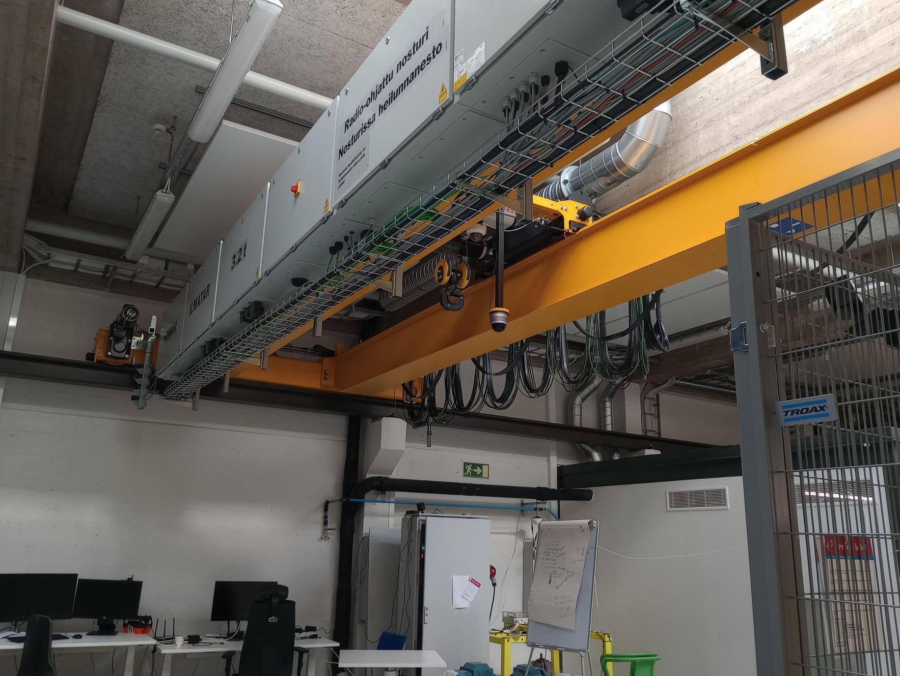
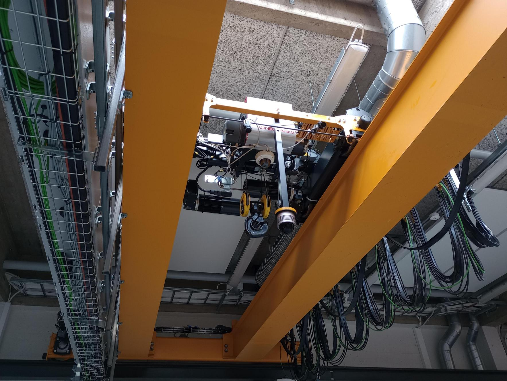
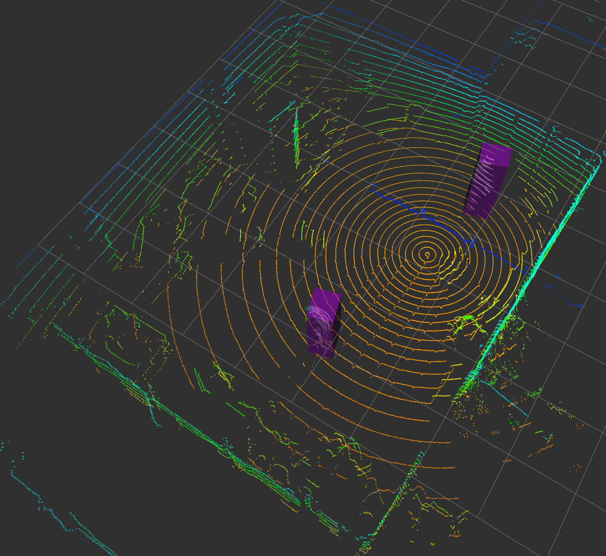
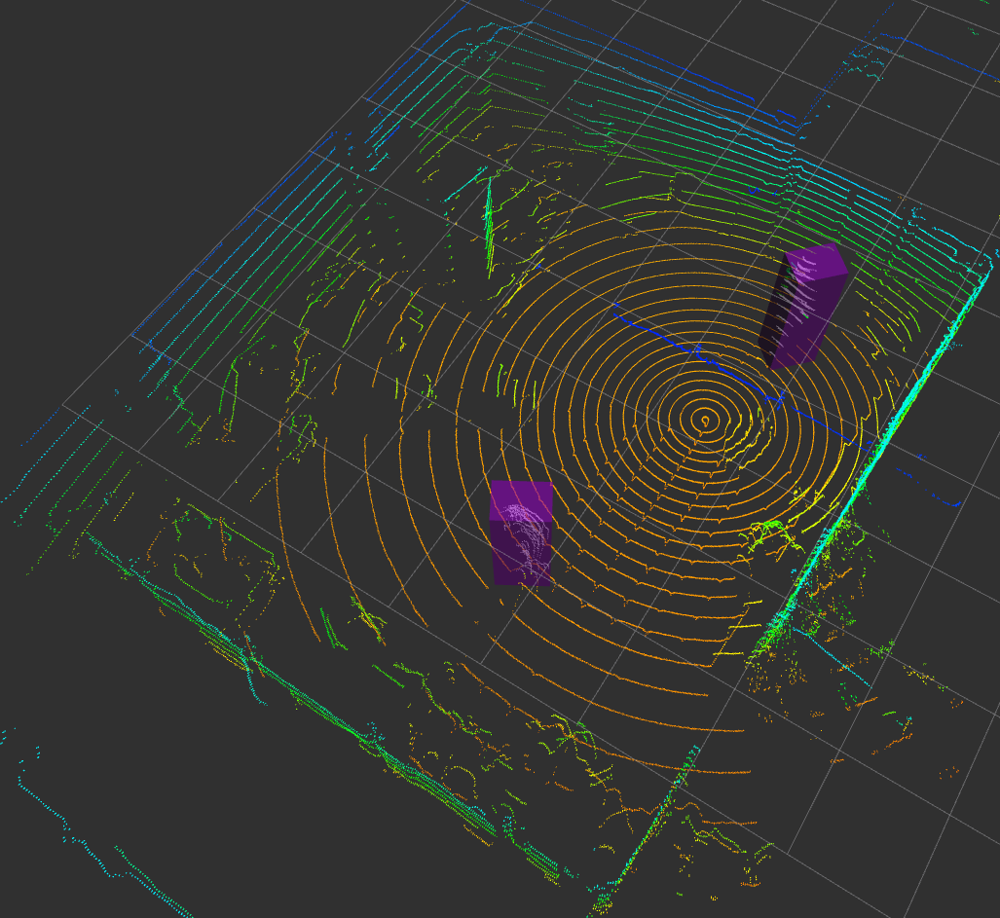
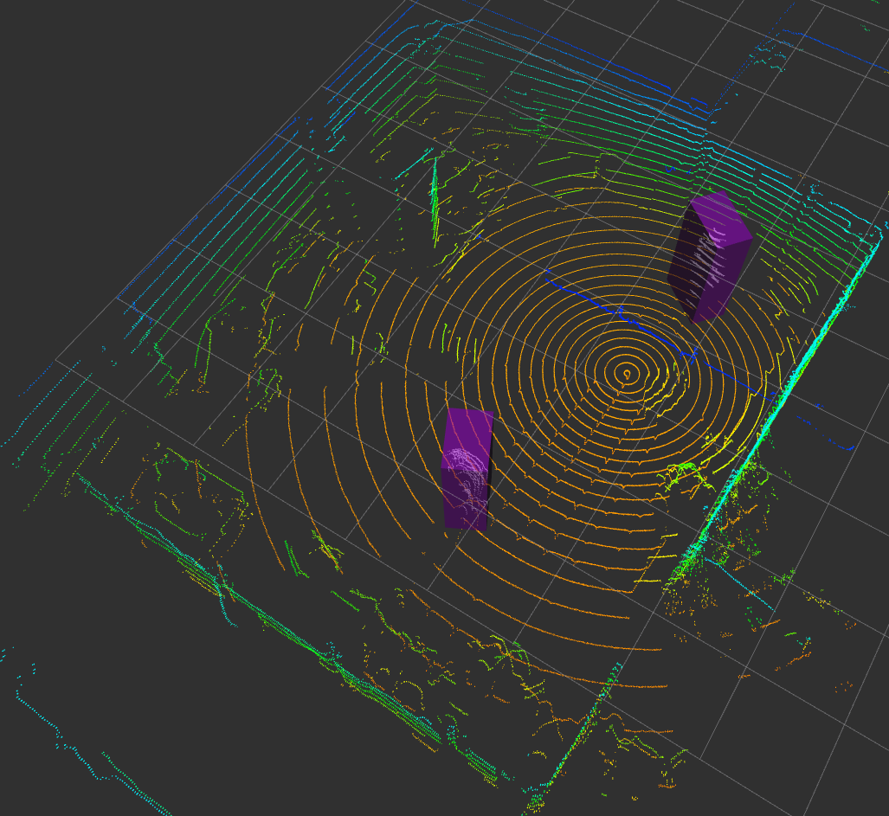
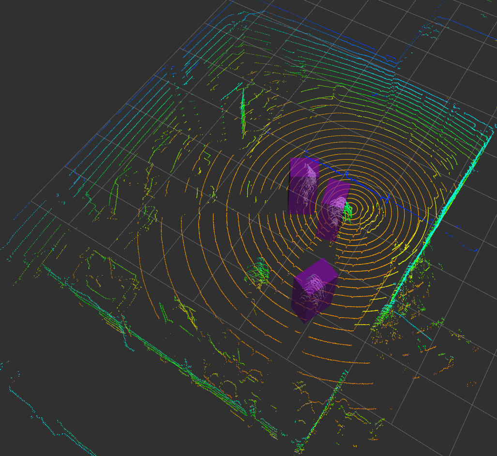
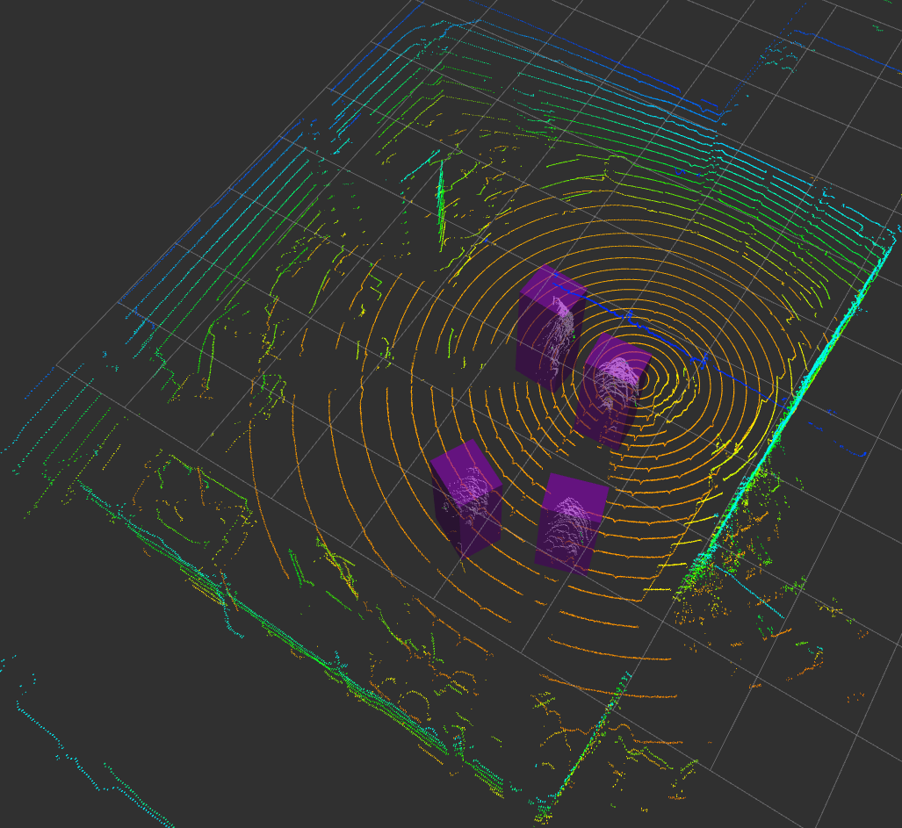
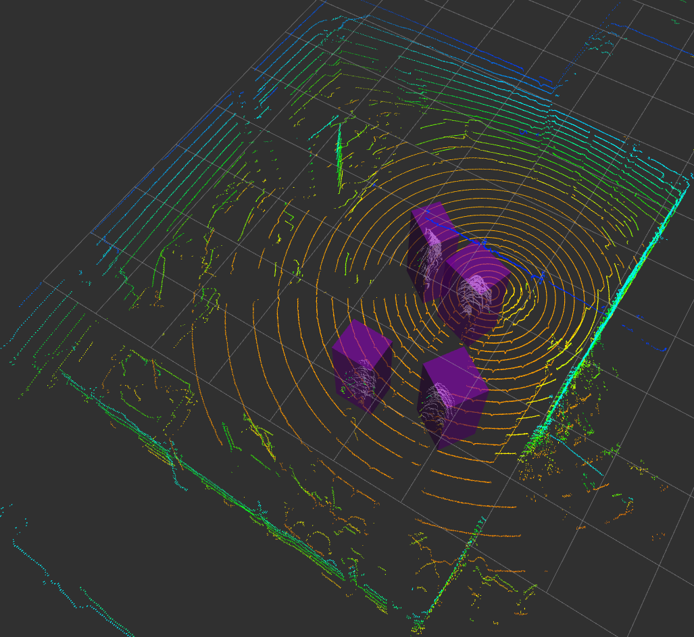

# O-LiPeDeT: Overhead LiDAR Person Detection and Tracking

This repository contains the data processing, models and training for Human Detection using a 3D Lidar attached to an overhead crane in an indoor work setting.

<table>
  <tr>
    <td align="center">
      
      <br/>
    </td>
    <td align="center">
      
      <br/>
    </td>
  </tr>
</table>

<table>
  <tr>
    <td align="center">
      
      <br/>
      <sub><b>PointPillars</b></sub>
    </td>
    <td align="center">
      
      <br/>
      <sub><b>SECOND</b></sub>
    </td>
    <td align="center">
      
      <br/>
      <sub><b>VoxelNeXt</b></sub>
    </td>
  </tr>

  <tr>
    <td align="center">
      
      <br/>
      <sub><b>PointPillars</b></sub>
    </td>
    <td align="center">
      
      <br/>
      <sub><b>SECOND</b></sub>
    </td>
    <td align="center">
      
      <br/>
      <sub><b>VoxelNeXt</b></sub>
    </td>
  </tr>
</table>


## Dataset

### Directory structure
```
/path/to/repo/
  lidar-human-detection/
    cfgs/
    data/
      det_dataset/           # dataset for evaluating detection models
        training/
          pointclouds/       # .bin files with float32 [x y z intensity]
          labels/            # .txt files, one object per line: “<class> x y z w l h yaw”
        validation/
          pointclouds/
          labels/
        test/
          pointclouds/
          labels/            # can be empty or omitted
      track_dataset/         # dataset containing temporal sequences (to be used as input for tracking)
        test/
          pointclouds/
          labels/            # can be empty or omitted
    fine_tuned_ckpts/        # to contain fine tuned checkpoints of detection models
    lidar_human_detection_models/
      utils/
    logs/                    # to contain train and validation plots
    outputs/
      pred_voxelnext/        # detections of voxelnext (other model predictions will be similarly stored)
        run_00/              # first run has no test time augmentations 
          preds/             # contains detections in .txt files per frame
  lidar-human-tracking/
    AB3DMOT/                 # contains inference (tracking: ab3dmot) script
      outputs/
    SimpleTrack/             # contains inference (tracking: simpletrack) script
      configs/
      outputs/

```

### Gathering real data with the crane

1. TODO

2. Run the following scripts under `data/` to convert to usable format.

```bash
python convert_pcd_to_bin.py /path/to/pcd_files /path/to/output
python convert_json_to_txt.py --input_folder /path/to/jsons --output_folder /path/to/txts
```


### Annotation

You can use any annotation tool as long as it can export (or can be converted) to the given dataset format. You can install `labelCloud` from [GitHub](https://github.com/ch-sa/labelCloud). Brief installation instructions for Ubuntu 24.04 are provided below:

```bash
cd ~
python3 -m venv labelcloud_venv
. labelcloud_venv/bin/activate
pip install labelCloud
labelCloud --example
```

## Installation (provided for HPC - Aalto Triton, CUDA 12.8)

```bash

# --- 1. Create conda environment ---
mamba env create -f environment.yml
source activate openpcdet

# --- 2. Verify CUDA toolkit inside the env ---
which nvcc && nvcc --version # should print: release 12.6, V12.6.x


# if nvcc points to a system version instead, run:
export CUDA_HOME="$CONDA_PREFIX"
export PATH="$CUDA_HOME/bin:$PATH"
export LD_LIBRARY_PATH="$CUDA_HOME/lib64:$LD_LIBRARY_PATH"

# --- 3. Install PyTorch + CUDA 12.6 ---
python -m pip install --upgrade "pip<25" "setuptools<75" "wheel>=0.41"
pip install torch torchvision torchaudio --index-url https://download.pytorch.org/whl/cu126

# confirm the PyTorch CUDA build (expected: Torch: 2.8.0+cu126  CUDA: 12.6):
python - <<'PY'
import torch
print("Torch:", torch.__version__, "CUDA:", torch.version.cuda)
PY 

# --- 4. Install OpenPCDet ---
git clone https://github.com/open-mmlab/OpenPCDet vendor/OpenPCDet
cd vendor/OpenPCDet
rm -rf build *.egg-info pcdet.egg-info
export TORCH_CUDA_ARCH_LIST="7.0;8.0;8.6;9.0"   # V100, A100, RTX30xx, H100
python -m pip install -e . --no-build-isolation --config-settings editable_mode=compat
cd ../..


# --- 5. Install matching Torch Scatter + Spconv (CUDA 12.6) ---
export PYTORCH_VER=$(python -c "import torch; print(torch.__version__.split('+')[0])")
pip install torch-scatter -f https://data.pyg.org/whl/torch-${PYTORCH_VER}+cu126.html
pip install "cumm-cu126" "spconv-cu126"

# --- 6. Sanity check ---
python - <<'PY'
import torch, pcdet
from pcdet.ops.iou3d_nms import iou3d_nms_cuda
from spconv.pytorch import SubMConv3d, SparseConvTensor
print("Torch:", torch.__version__, "CUDA:", torch.version.cuda)
print("pcdet import OK")
print("iou3d_nms_cuda import OK")
print("spconv import OK")
PY

```

## Usage

```bash

source activate openpcdet #. scripts/source.sh

export PYTHONPATH=$PWD:$PYTHONPATH # NOTE: execute after going to detection dir (/PATH/TO/DIR/lidar-human-detection-models)

# --- training (detection) ---
python lidar_human_detection_models/train.py \
  --cfg_file ./cfgs/nuscenes_voxelnext.yaml \
  --dataset_cfg_file ./cfgs/voxelnext_crane.yaml \
  --pretrained_ckpt ./models/voxelnext_nuscenes_kernel1.pth \
  --output_dir ./fine_tuned_ckpts \
  --batch_size 4 \
  --epochs 200 \
  --lr 5e-4

# --- inference: export predictions to text files (detection) ---
python lidar_human_detection_models/inference.py \
  --cfg_file ./cfgs/nuscenes_voxelnext.yaml \
  --dataset_cfg_file ./cfgs/voxelnext_crane.yaml \
  --ckpt ./fine_tuned_ckpts/finetuned_voxelnext_250.pth \
  --out_dir outputs/preds_voxelnext \
  --conf_thresh '{"1": 0.45}' \
  --topk 5
  
# --- inference (tracking - AB3DMOT) ---
python3 ab3dmot_tracking.py \
  --in_dir /PATH/TO/REPO/lidar-human-detection-models/outputs/preds_for_tracks_voxelnext/run_00/preds \
  --out_dir outputs/ab3dmot_txt_voxelnext \
  --fps 3.0 \
  --max_age 3 --min_hits 2 --w_maha 1.0 --w_iou 0.3 \
  --default_score 1.0
  
# --- inference (tracking - SimpleTrack) ---
python3 simpletrack_tracking.py \
  --in_dir /PATH/TO/REPO/lidar-human-detection-models/outputs/preds_for_tracks_voxelnext/run_00/preds \
  --out_dir outputs/simpletrack_txt_voxelnext \
  --config_path configs/crane_ped.yaml \
  --obj_type box \
  --fps 3.0 \
  --default_score 1.0 \
  --score_threshold_override 0.0
```

## Acknowledgment

This work was funded in part by Business Finland under the TwinFlow project (7374/31/2023), and in part by the Finnish Centre for Economic Development, Transport and the Environment under the TECHBOOST project
(0124/05.02.09/2023A). The work as conducted in the premises of Aalto University, where the overhead crane workspace was located (Industrial Internet Campus, School of Engineering).

## License

The files created for this repository are shared under the MIT license.

 
